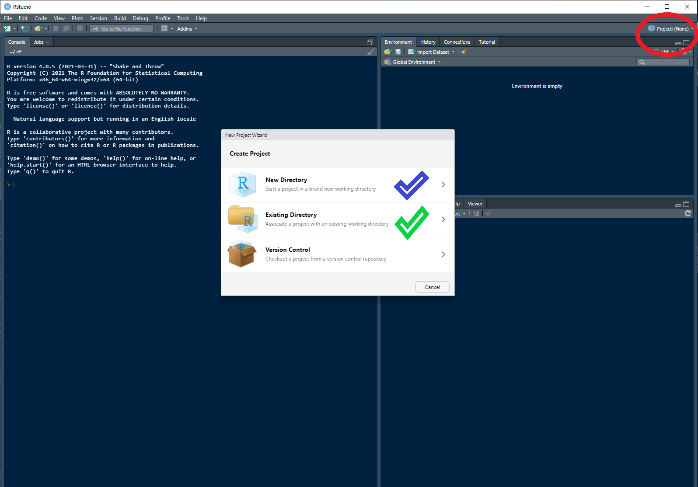

```{r, include = FALSE}
knitr::opts_chunk$set(
  collapse = TRUE,
  comment = "#>"
)
```


## Weclome to oxyQ!
The purpose of `oxyQ` is to aid in quality checking raw sonde sampling data and 
to provide helpful functions for the monitoring of oxygenation plants.

The easiest way to interact with the `oxyQ` package is to work within an RStudio 
project.

## RStudio project
Working within a project can help abstract away the need for the user to deal with 
long and unwieldy file paths.

If you are familiar with RStudio projects then just make sure you create one and 
work within it. If you're not sure read on.

First up open up RStudio and in the top right hand corner (circled in red) click 
and open the dialogue box displayed below.

{width=70%}

You have the option to either create the project in a new directory (blue tick) 
or use an existing one (green tick). I would suggest starting fresh with a new one. 
From your selection follow the prompts to create a new project. 

If you are familiar with version control and GitHub feel free to either check out 
a repo or create a git repo. If all of that is alien to you then a standard new 
project is what you are after.

You can call your project whatever you like and you will know you have been 
successful as the name will now be displayed where that red circle was in the 
picture above.


## Install `oxyQ` and load it
You only need to install the package once (unless you are updating it). The 
package lives on GitHub so you will need the package `devtools` to install. To get 
started open a new R file and copy and run the code below.
```{r, install, eval=FALSE}
# Install and load oxyQ
# install.packages("devtools")
devtools::install_github("dbca-wa/oxyQ")
library(oxyQ)
```

It's likely that there are a few other packages that you may not have installed. 
If so you will get a prompt to install them. Follow the onscreen dialogue to 
install them.


## Running `flagR` - The Rules
`flagR` has been written to highlight possible suspect samples from raw sonde 
data according to some pre-determined rules. These rules include:
  
  *   *Sample stability*. The sensors must remain at a depth for a period of time 
long enough to allow measurements to stabilise. This is determined by allowing 
enough time for the depth and the Vpos variables to converge. The threshold 
for convergence is +/- 0.1m. Quality code is 01000.

*   *Out of sequence*. Measurements are taken from the river bottom to the surface. 
If a sample is recorded at a deeper depth than the preceding sample at a site 
then it is flagged. Quality code is 00100.

*   *Duplicate*. A sample that is taken within 0.1m of another is deemed a duplicate.
Quality code is 00010.

*   *Transect issue*. A site sample that has been recorded outside of the established 
spatial envelope or incorrectly named for that transect is a quality issue. 
Quality code is 00001.

To use `flagR` on some raw sonde data you will need to know the complete file path 
to the data csv. If you copy the raw data to your newly created RStudio project then 
the file path is easy and manageable. The raw data csv should be named in the format 
YYYYMMDD_GUI or YYYYMMDD_CAV. 

To use `flagR` using data fictitious data from Caversham collected on the 1st of 
January 2020:
```{r, flagr, eval=FALSE}
# From a csv within the project:
flagR(file = "./20200101_CAV.csv")
# To use from a csv in a far away file location:
flagR(file = "Q:/Monitoring/WA/Perth/Swan and Canning/2020/Oxyplants/raw data/20200101_CAV.csv")

```

**NOTE** if you copy and paste a file path from windows you will need to either 
double up the backslashes or convert them to single forward slashes as in the 
example above.

**BEWARE** Outputs will be written to the project location or if you are not working in a 
project they will be written to wherever the current working director of the r 
session you are running is set.

## `flagR` outputs
There are three main outputs from running `flagR`:
  
  *   *Quality flagged data*. This is all the original raw data simply with a new 
column (variable) named `QUAL` that will contain combinations of the codes 
described in the rules section above. Data is written to csv and will have 
"R1" added to the name e.g. 20200101_CAV_R1.csv

*   *Quality flagged shape file*. This is an Esri shape file with all of the above 
information in it's attribute table. This enables the user to visualise where 
    the data was collected. e.g. 20200101_CAV.shp etc (a shape file has 4 associated files).
    
*   *Profile plots*. These plots show the site samples, grouped into their respective 
    transects showing with decreasing depth one of three physical parameters. The 
    parameters are salinity, temperature and density using the UNESCO formula. Each 
    site within a transect is offset by an indicated amount so that the traces do 
    not overplot. e.g. 20200101_CAV_temperature_profile.png etc.
    
**NOTE** All spatial outputs are transformed to GDA2020 MGA50 (EPSG:7850).
    
Some examples of `QUAL` code combinations and meanings:

*   **10000** - OK.

*   **11000** - Sample stability issue.

*   **10011** - Duplicate record and outside of transect envelope.


## Using the `profile_plotR`
When the `flagR` function is run, internally it calls on `profile_plotR` to produce 
the salinity, temperature and density plots. If the user wants to create another 
iteration of profile plots, for example after removing some bad data on review of 
the quality flags, use the below as an example.
```{r, profile_plotR, eval=FALSE}
# full file path to quality flaggged data
file <- "./to_location/of_the/quality_flagged_data/20200101_CAV_R1.csv"

# run the profile plot function
profile_plotR(file, rerun=TRUE)
```
 
